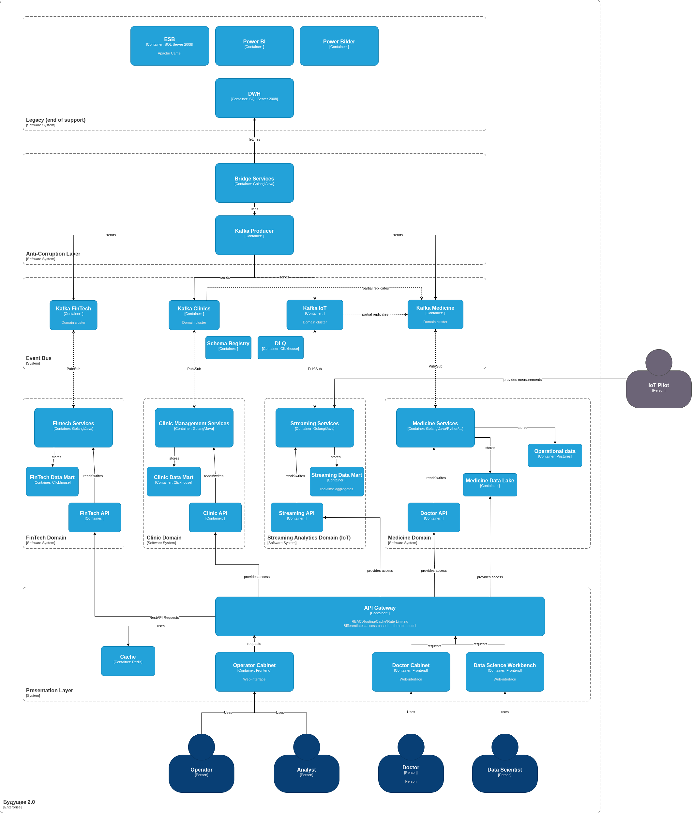
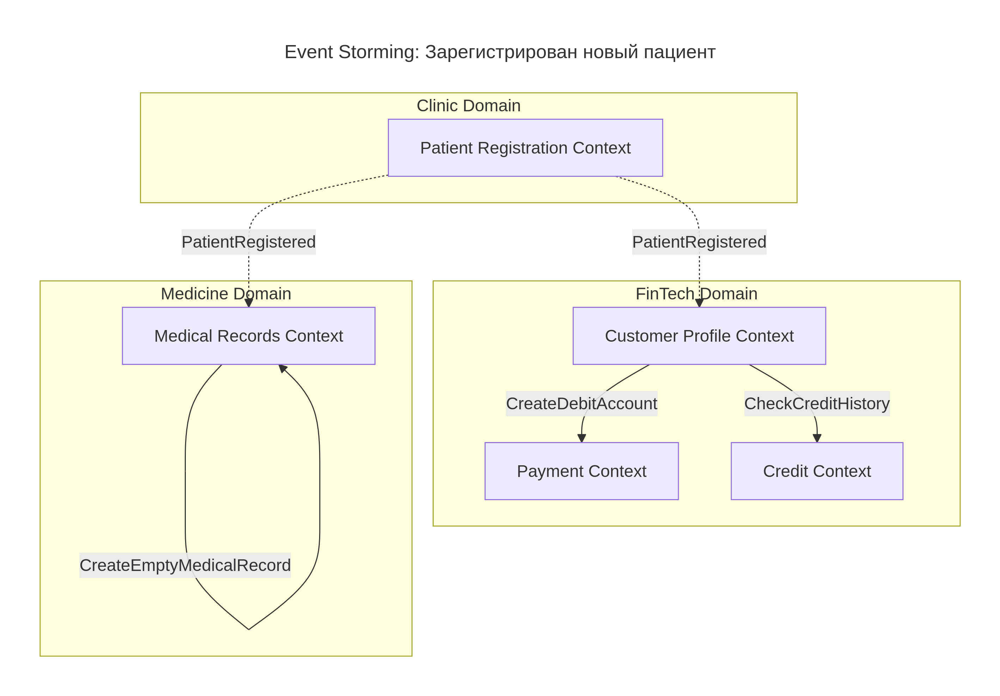
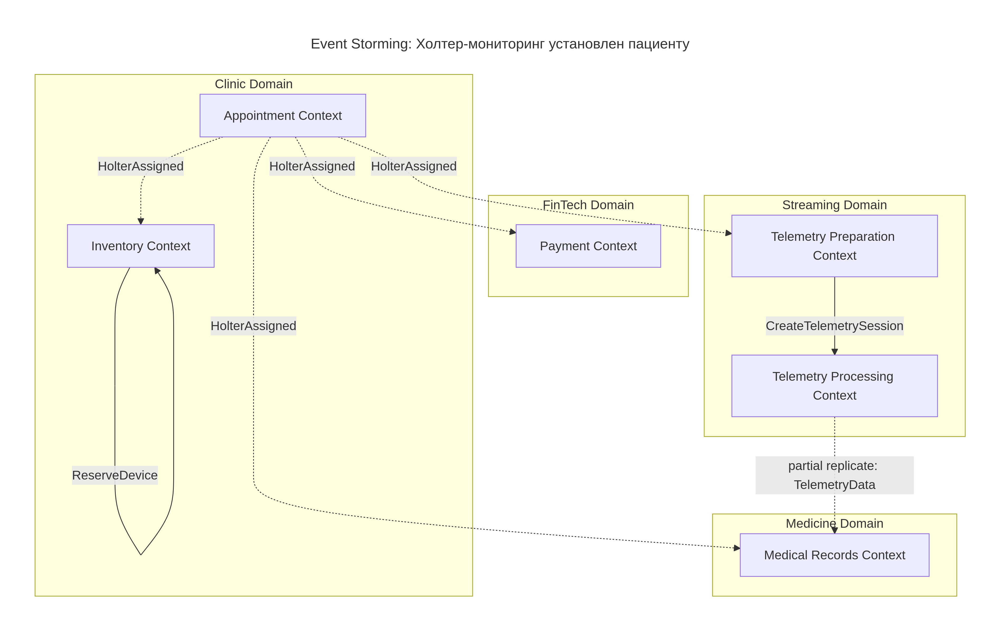
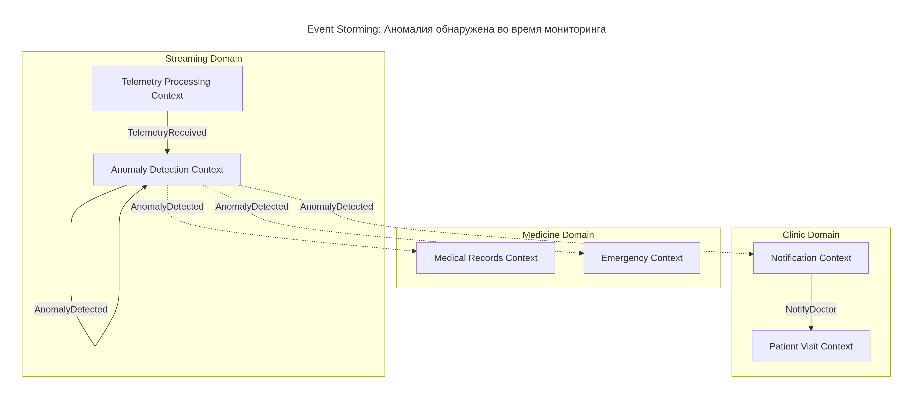
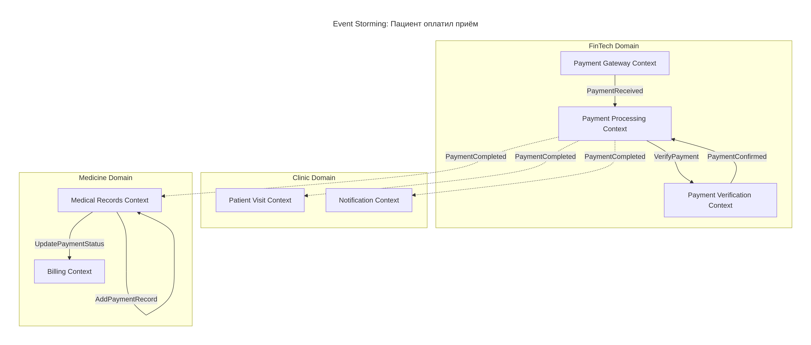

# Будущее 2.0: трансформация IТ-ландшафта в области работы с данными

## Задание 1. Модульная инфраструктура для нескольких сред
[Task_1](Task_1/)

## Задание 2. Интеграция с CI/CD и удалённым хранением состояния
[Task_2](Task_2/)

## Задание 3. Проектирование целевой архитектуры и оценка рисков внедрения

### Целевая архитектура "Будущего 2.0"

#### Описание схемы

Система через 3 года представляет собой слабосвязанную событийную платформу. Ключевые изменения:

1. Отказ от легаси: Системы DWH (SQL Server 2008), ESB (Camel), Power BI и PowerBuilder выведены в зону Legacy (end of support). Их функциональность замещается новой архитектурой.

2. Антикоррупционный слой (Anti-Corruption Layer): Bridge Services обеспечивают временную интеграцию с легаси, транслируя данные в событийную платформу.

3. Событийное ядро (Event Bus): Центральный узел интеграции на базе Apache Kafka. Включает отдельные кластеры для доменов (FinTech, Clinic, Streaming, Medicine), а также общие сервисы: Schema Registry (управление схемами) и DLQ (обработка ошибочных сообщений).

4. Домены и витрины: Выделены независимые домены (FinTech, Clinic, Streaming Analytics, Medicine). Каждый домен владеет своей аналитической витриной (Data Mart) и бизнес-сервисами. Данные Medicine Domain (Data Lake) изолированы от портала в соответствии с требованием бизнеса.

5. Портал самообслуживания: Пользователи (Operator, Analyst) взаимодействуют с Operator Cabinet через API Gateway. API Gateway обеспечивает RBAC (разграничение доступа), Rate Limiting, маршрутизацию и кэширование (Redis). Запросы к витринам данных (FinTech, Clinic, Streaming) выполняются через REST API.

6. Геораспределение и региональность (перспектива выхода на новые рынки):
   В рамках планов по выходу в новые регионы (горизонт 3 лет) архитектура поддерживает многокластерную модель. Для геораспределённых доменов (например, Clinic Domain при открытии клиник за рубежом) развёртываются отдельные Regional Kafka clusters в каждом регионе.

   - Локальная обработка: Обеспечивает низкую задержку для операционных сервисов клиники.
   - Соблюдение регуляторных требований: Данные пациентов остаются в регионе (GDPR, 152-ФЗ и др.).
   - Синхронизация: Агрегированные и обезличенные данные синхронизируются между регионами с помощью Kafka MirrorMaker (на схеме не показано для упрощения). Это позволяет строить глобальную отчётность без создания единой точки отказа.

7. Изоляция медицинских данных: Medicine Data Lake недоступен из портала самообслуживания. Доступ к нему имеют только Data Scientist для обучения ML-моделей в строго контролируемой среде.»

### Риски в процессе трансформации и меры их минимизации
[transformation-risks.md](Task_3/future-2_0-transformation-risks.md)

## Задание 4. Моделирование домена и интеграций

[Task_4](Task_4/)

## Задание 5. Проектирование технологического стека и расчёт стоимости
[future-2_0-tech-radar.md](Task_5/future-2_0-tech-radar.md)

[future-2_0-tco-analysis.md](Task_5/future-2_0-tco-analysis.md)

[future-2_0-roadmap.md](Task_5/future-2_0-roadmap.md)